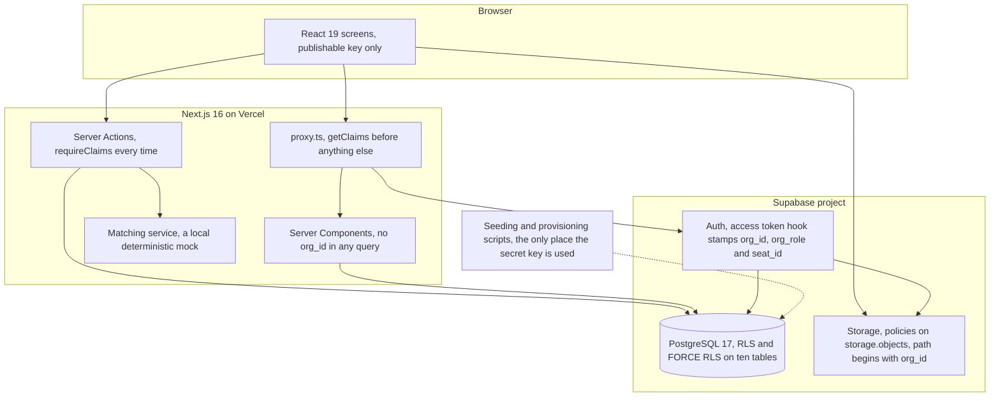

# Fieldstone Lending Network: loan officer portal

A working multi-tenant portal for loan officers, built as a prototype to be
inspected rather than admired. Lender organisations are tenants. The tenant
boundary is enforced by the database and by storage, not by the user
interface, and not by remembering to add a filter.

Fieldstone Lending Network is an invented brand. Every borrower, lender,
address and figure in it is seeded test data. Nothing in this repository calls
an external system: the lender matching and the property valuation are local
modules, marked as stubs at the top of their files, and they reach no network.

## Live

- Portal: https://fieldstone-portal.vercel.app

That URL is open: an anonymous request with no cookies returns the portal's
own sign in page and every security header, recorded in
[docs/evidence/live-headers.txt](docs/evidence/live-headers.txt). Every
requirement was then verified against it in a real Chrome window, twice, and
the transcript with a screenshot per requirement is in
[docs/screenshots/live-run.md](docs/screenshots/live-run.md).

Sign in as two different tenants and compare what each can see. The password is
the same for both and is shared privately; it is not in this repository and no
script prints it.

| Tenant | Seat | Email |
| --- | --- | --- |
| Harborline Mortgage Group, premium tier | Loan officer | `harborline.lo@fieldstone.example` |
| Bayou City Lending Co, no premium tier | Manager | `bayoucity.manager@fieldstone.example` |

Worth doing in that order: sign in as the first, open a borrower, copy the URL,
then sign in as the second and paste it. The page does not say "forbidden". The
record does not exist as far as the second tenant's queries are concerned.

## What it does

- Organisations, named seats with one live session each, and three roles.
- Borrower profiles, search, filtering, and CSV import with per row errors and
  duplicate detection.
- Documents in private storage, served only through links that expire.
- Financing scenarios against a matching service, returning ranges against an
  alias rather than a lender's identity.
- A submission queue with assignment and a status machine only a manager can move.
- A fee ledger totalled by month, with unreconciled entries flagged.
- A branded public intake link per lender, usable with no account at all.
- An organisation page where an administrator rebrands the tenant, and cannot change its tier.
- A premium tier gate, decided on the server.
- An audit trail the application cannot write to.

## Architecture



Which arrow means what:

- The browser holds the publishable key only, and reaches the proxy, the
  server actions and storage.
- `proxy.ts` calls `getClaims` before anything else, and is the only thing
  that talks to Auth about verifying or refreshing a token.
- Server Components and Server Actions reach PostgreSQL **as the signed in
  user**, never as an admin, so row level security applies to them.
- Auth stamps the claims that every policy in the database and in storage
  reads.
- The dotted arrow is the seeding and provisioning scripts. They hold the
  secret key and never run inside a request.

<details>
<summary>Diagram source</summary>



Rendered to `docs/architecture.svg` with
[mermaid-cli](https://github.com/mermaid-js/mermaid-cli):

```bash
npm run diagram
```

</details>

Every request runs as the signed in user. The secret key, which bypasses row
level security, is used by two scripts and by nothing in any request path.

## How the tenant boundary is enforced

The short version: the database refuses, so the application does not have to
remember.

**Claims come from a token, not from the page.** A Postgres function runs on
every token issue and refresh. It finds the caller's seat and writes `org_id`,
`org_role`, `seat_id` and `is_demo_admin` into the token. A user cannot call
that function; execute is revoked from everyone except the auth admin. The
portal role travels as `org_role` and not as `role`, because `role` is what
decides which Postgres role runs the request.

**Row level security, on every table.** Each policy compares `org_id` against
the claim. With RLS enabled and no matching policy, Postgres denies by default.
`FORCE ROW LEVEL SECURITY` removes even the table owner's exemption.

**Revoke before grant.** The platform grants the API roles broad privileges on
everything created in the public schema. A schema that only adds narrow grants
therefore restricts nothing. This one revokes first, then grants exactly what
each role needs, including two column level grants: an administrator can
rebrand its organisation but cannot grant itself the premium tier or the demo
admin flag. That defect was real, and it is written up in
[docs/evidence/privilege-defect-and-fix.txt](docs/evidence/privilege-defect-and-fix.txt).

**Storage by path.** Objects live at `<org_id>/<borrower_id>/<file>`, and the
policies on `storage.objects` compare the first path segment against the claim.
The bucket is private, capped at 10 MB, and limited to PDF, PNG and JPEG by the
bucket itself. Downloads are signed URLs that expire in five minutes.

**Writes the application makes.** Server actions read the tenant from verified
claims and never from a form. The database checks it again through WITH CHECK,
so a crafted request fails twice.

### What the database enforces, and what the application does

| Enforced by the database or storage | Left to the application |
| --- | --- |
| Which rows a request can see or change | Which screen you land on |
| Which organisation a new row may belong to | Friendly messages and empty states |
| Who may delete, and who may change branding | Ordering, paging and search wording |
| That a quote cannot be edited after the fact | Courtesy checks before an upload |
| That an object path stays inside one tenant | Nothing that matters if bypassed |

### Threat model, briefly

- **A forged or edited cookie.** `getClaims()` verifies the token signature on
  every request. `getSession()` is never trusted in server code.
- **A crafted form post naming another tenant.** The tenant is read from claims,
  and WITH CHECK refuses the row regardless.
- **Guessing a URL.** A record outside the tenant does not exist for that query,
  so the page is a 404 rather than a refusal that confirms it exists.
- **An administrator escalating.** Column level grants stop the premium and demo
  admin flags being written at all.
- **A stolen session.** A seat holds one live session. A fresh sign in moves it
  and the displaced session cannot refresh. An access token already issued stays
  valid until it expires, which is why the lifetime is 600 seconds. That worst
  case is stated on the Sessions screen rather than hidden.
- **A malicious upload.** Size and type are enforced by the bucket, the folder by
  storage policies, and the recording action re-reads both from storage rather
  than believing the browser.
- **Search input.** PostgREST treats an `or` filter as syntax, so the term is
  stripped of anything that could terminate or nest a filter.

Not defended against, and out of scope for a prototype: a compromised secret
key, a malicious database administrator, and denial of service.

## The same design on SQL Server and EF Core

The model is not tied to Postgres. Every piece has a direct equivalent, so a
.NET team reads this and sees their own stack.

| Here | On SQL Server with EF Core |
| --- | --- |
| `CREATE POLICY ... USING (...)` | `CREATE SECURITY POLICY ... ADD FILTER PREDICATE` |
| `CREATE POLICY ... WITH CHECK (...)` | `ADD BLOCK PREDICATE ... AFTER INSERT`, `AFTER UPDATE` |
| `(select auth.jwt() ->> 'org_id')` | `CAST(SESSION_CONTEXT(N'TenantId') AS uniqueidentifier)` |
| Claims written by the access token hook | `sp_set_session_context @key = N'TenantId', @value = @tenantId, @read_only = 1`, executed in a `DbConnectionInterceptor.ConnectionOpenedAsync` |
| `FORCE ROW LEVEL SECURITY` | No equivalent: `dbo` and `db_owner` bypass, so the application must connect as a non owner login |
| Second layer in the application | `modelBuilder.Entity<Borrower>().HasQueryFilter(b => b.TenantId == tenantId)`, with `IgnoreQueryFilters` forbidden in review |
| Security definer helper functions | Inline table valued predicate functions `WITH SCHEMABINDING` in a `Security` schema |
| Revoke before grant | The same discipline: revoke the broad grant, then grant per table and per column |

The predicate function is the security boundary in both. The query filter is the
convenience layer in both. Neither is a substitute for the other.

## What is mock, and where the real thing plugs in

| Stub | File | What replaces it |
| --- | --- | --- |
| Lender matching | `lib/matching/mock.ts` | A second class implementing `MatchingService` from `lib/matching/types.ts`, returned by `lib/matching/index.ts`. One line. No screen, action or table changes. |
| Property intelligence | `lib/property-intelligence.ts` | The same function signature, calling the real engine. |

Both report what they are. The scenario results screen prints the source of the
run, so mock output cannot be mistaken for live output. An HTTP boundary in the
shape a real integration would take is at `app/api/mock/matching/route.ts`.

## Running it locally

```bash
cp .env.example .env.local            # then fill in the seven values
npm install
npm run provision -- --apply-schema   # schema, auth hook, token lifetime, bucket
npm run seed:users                    # the nine demo accounts
npm run dev
```

`supabase/SETUP.md` has the detail and a dashboard cross-check. The schema and
the isolation tests also run with no project at all, against PostgreSQL compiled
to WebAssembly:

```bash
npm run test:schema -- --local
```

## Evidence

- [docs/REQUIREMENTS-TRACE.md](docs/REQUIREMENTS-TRACE.md): one row per sentence
  of the job posting, in the client's own order, with where it lives, how it
  was checked and what the check produced.
- [docs/DECISIONS.md](docs/DECISIONS.md): the choices made while building, each
  with its reason in one line.
- [VERIFICATION.md](VERIFICATION.md): the fourteen checks from the build plan,
  each with the command that proves it and the file holding the output, plus the
  two defects the tests caught.
- [RESEARCH.md](RESEARCH.md): every version, flag, API shape and platform limit
  this build relies on, with the official source and the date it was read.
- [docs/evidence](docs/evidence): raw output, including the secret sweep, the
  upload refusals, the privilege defect and the scale run.
- [docs/screenshots](docs/screenshots): every screen at desktop and 390 pixels,
  with what each one proves.
- [docs/screenshots/live-run.md](docs/screenshots/live-run.md): every
  requirement driven against the deployed URL in a real Chrome window, twice in
  a row with no failures, with its own screenshot in
  [docs/screenshots/live](docs/screenshots/live).
- [docs/demo](docs/demo): a 40 second walkthrough, recorded against the
  deployed URL in one unedited session.
